# 🧠 cozyad-cti-lab

### Production-Grade Azure Threat Intelligence Platform | OpenCTI | MITRE ATT&CK | Microsoft Sentinel

> *A personal threat intelligence lab built to bridge 20 years of operational intelligence experience with modern commercial CTI engineering — from concept to production on Azure for under £10/month.*

-----

## Overview

This project documents the design, deployment, and ongoing development of a production-grade Cyber Threat Intelligence (CTI) platform built entirely on Microsoft Azure. The platform centralises threat intelligence into a structured knowledge graph, correlating threat actors, malware, TTPs, CVEs, and indicators across multiple live feeds — enriched with MITRE ATT&CK mappings and prepared for integration with Microsoft Sentinel and Defender XDR.

This is not a tutorial follow-along. It’s a working platform built from first principles, informed by real-world operational intelligence experience in UK law enforcement cyber crime.

-----

## Architecture

```mermaid
graph TB
    subgraph Azure["☁️ Microsoft Azure"]
        subgraph VM["Ubuntu 22.04 VM (B2s) — NSG: Home IP Only"]
            subgraph Docker["Docker Compose Stack"]
                OC[OpenCTI Platform]
                ES[Elasticsearch]
                RMQ[RabbitMQ]
                RD[Redis]
                MN[MinIO]

                subgraph Connectors["Connectors"]
                    C1[MITRE ATT&CK]
                    C2[AlienVault OTX]
                    C3[Malware Bazaar]
                    C4[PhishTank]
                    C5[CISA KEV]
                end

                C1 & C2 & C3 & C4 & C5 -->|STIX 2.1| RMQ
                RMQ --> OC
                OC --> ES
                OC --> RD
                OC --> MN
            end
        end

        LAW[Log Analytics Workspace]
        DEF[Microsoft Defender]
        SEN[/"Microsoft Sentinel\n(In Progress)"/]

        VM --> LAW
        VM --> DEF
        LAW -.->|Planned| SEN
    end

    ATTACK[🌐 MITRE ATT&CK] --> C1
    OTX[🌐 AlienVault OTX] --> C2
    MB[🌐 Malware Bazaar] --> C3
    PT[🌐 PhishTank] --> C4
    KEV[🌐 CISA KEV] --> C5
```



-----

## Stack

|Component          |Technology                     |
|-------------------|-------------------------------|
|Cloud Platform     |Microsoft Azure                |
|VM OS              |Ubuntu Server 22.04 LTS        |
|CTI Platform       |OpenCTI 6.x                    |
|Containerisation   |Docker Compose                 |
|Search & Storage   |Elasticsearch                  |
|Message Queue      |RabbitMQ                       |
|Cache              |Redis                          |
|Object Storage     |MinIO                          |
|SIEM (In Progress) |Microsoft Sentinel + LAW       |
|Endpoint Protection|Microsoft Defender for Cloud   |
|IaC                |YAML / .env (Terraform planned)|
|Remote Access      |SSH (IP-restricted NSG)        |

-----

## Threat Intelligence Feeds

### Live Connectors

**MITRE ATT&CK**

- Full ATT&CK Enterprise matrix ingested
- Tactics, techniques, sub-techniques, software and threat actor group profiles
- Provides the analytical backbone for TTP mapping across all other feeds

**AlienVault OTX**

- Community and vendor-contributed threat intelligence
- IOCs including IPs, domains, file hashes, and URLs
- Pulse-based ingestion with automatic STIX object creation

**Malware Bazaar (Abuse.ch)**

- High-volume malware sample metadata
- File hashes, tags, malware family classifications
- Real-time feed of newly submitted samples

**PhishTank**

- Verified phishing URL database
- Community-verified indicators
- Useful for credential harvesting campaign tracking

**CISA Known Exploited Vulnerabilities (KEV)**

- CISA’s authoritative catalogue of CVEs actively exploited in the wild
- Prioritised vulnerability intelligence used by every serious threat intel team
- Cuts through NVD noise — if CISA says it’s being exploited, it matters
- Critical for understanding what threat actors are actually using right now

### Data Flow

```
External Feeds → Connectors → RabbitMQ → OpenCTI Workers → Elasticsearch
                                                                    ↓
                                                         Knowledge Graph
                                                         (STIX 2.1 objects)
                                                                    ↓
                                              ATT&CK Enrichment & Correlation
                                                                    ↓
                                                    [Sentinel — In Progress]
```

-----

## Security & Infrastructure

Designed in alignment with the [Azure Well-Architected Framework](https://learn.microsoft.com/en-us/azure/well-architected/) security pillar:

- **Network Security Group (NSG)**: Inbound access restricted to single home IP — deny-by-default, explicit permit only. No public exposure
- **Microsoft Defender for Cloud**: VM-level threat protection, vulnerability assessment and security recommendations
- **Log Analytics Workspace**: Centralised diagnostic logging and security event visibility foundation for Sentinel
- **Least Privilege / RBAC**: Service accounts and roles scoped to minimum required permissions, aligned with Zero Trust principles
- **Cost Controls**: Budget alerts configured, right-sized VM selection for sub-£5/month operation
- **Planned**: Microsoft Entra ID managed identities to eliminate stored credentials — current best practice for Azure workload identity

-----

## Why I Built This

I have spent 20 years delivering threat intelligence operationally in UK law enforcement. I understood threat actors. I understood the intelligence cycle. I understood how to produce assessments that drove decisions. What I wanted to develop was the engineering side — how commercial CTI teams actually build and operate the platforms that underpin modern threat intelligence functions.

This lab is the answer to that question. Built from scratch, on a real cloud platform, with real data, at production standards — not a lab exercise but a working system I actively use and develop.

It’s also a deliberate attempt to understand both sides of the intelligence function: the analytical craft I’ve practiced for two decades, and the technical infrastructure that makes scaled CTI operations possible in commercial environments.

-----


### Planned

- [ ] Additional OSINT feeds — abuse.ch URLhaus, Feodo Tracker
- [ ] Malware sandbox connector integration
- [ ] AI-assisted triage workflows — automated analyst and executive-level intelligence summaries
- [ ] Terraform IaC — reproducible multi-cloud deployment (AWS, GCP portability)
- [ ] Microsoft Entra ID managed identities — eliminate stored credentials, align with Zero Trust identity best practice
- [ ] Azure Policy governance — compliance and security rule enforcement across resources
- [ ] Honeypot VM — deliberate exposure for adversary observation, feeding IOCs back into OpenCTI
- [ ] Simulated adversary campaigns — ATT&CK emulation using Atomic Red Team
- [ ] Deception-based detection layer

-----

## Skills Demonstrated

`Threat Intelligence` `MITRE ATT&CK` `OpenCTI` `Microsoft Azure` `Docker Compose` `Elasticsearch` `STIX 2.1` `Microsoft Sentinel` `Log Analytics` `Linux Administration` `Infrastructure as Code` `Cloud Security` `Azure Well-Architected Framework` `Microsoft Entra ID` `Zero Trust` `Intelligence Cycle` `TTP Analysis` `IOC Management`

-----

*“The best threat intelligence comes from understanding how adversaries think — not just what tools they use.”*

-----

> ⚠️ This repository documents architecture, methodology and tooling only. No sensitive data, credentials, or operational intelligence is included or referenced.
